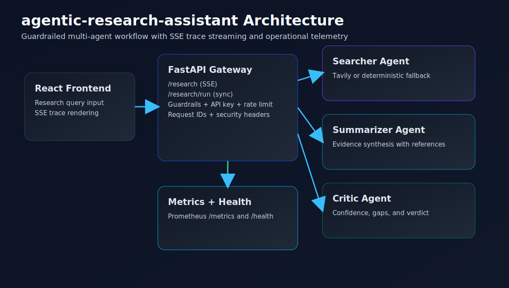
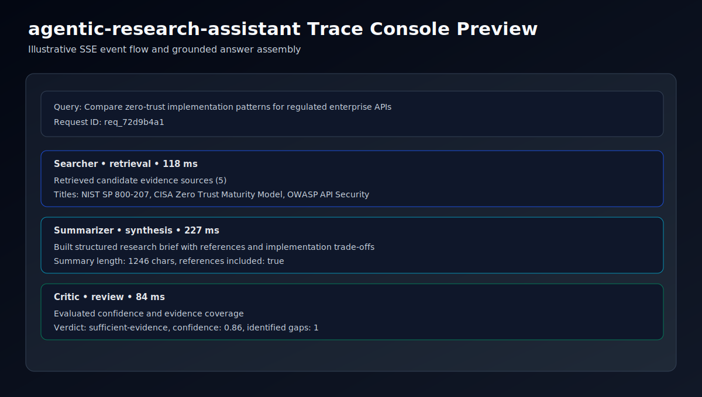

<!-- Generated by GitHub Copilot -->
# agentic-research-assistant

Production-ready multi-agent research system with LangGraph orchestration, real-time SSE traces, guardrails, and operational monitoring.


## Implemented Scope

1. Searcher, Summarizer, and Critic agents with structured trace events.
2. LangGraph orchestration with single-run streaming and synchronous execution paths.
3. FastAPI endpoints for health, SSE streaming, synchronous research run, and metrics.
4. Input guardrails, request IDs, rate limiting, CORS allowlist, and security headers.
5. React frontend for streaming trace cards and final source-grounded answer rendering.
6. Integration and unit tests for API and agent behavior.
7. Governance baseline: contributing, security, architecture, API, deployment, testing, changelog, prompt guide, templates, ownership.

## Repository Layout

1. `api/main.py` - API service, SSE stream endpoint, and operational controls.
2. `agents/` - Searcher, Summarizer, Critic, and LangGraph workflow.
3. `frontend/` - React research console and trace visualization UI.
4. `prompts/` - role instructions for each agent.
5. `tests/` - backend API and agent unit/integration coverage.
6. `docs/` - architecture, API, deployment, testing, and prompt governance.

## Run Backend

```bash
pip install -r requirements.txt
uvicorn api.main:app --reload --port 8002
```

Optional backend security env vars:

```bash
RESEARCH_API_KEY=
RATE_LIMIT_PER_MINUTE=90
```

## Run Frontend

```bash
cd frontend
npm ci
npm run dev -- --host 0.0.0.0 --port 4175
```

## Visual Evidence

Architecture overview:



Trace console preview:



## API Endpoints

1. `GET /health`
2. `GET /research` (SSE stream, protected when API key is configured)
3. `POST /research/run` (sync execution, protected when API key is configured)
4. `GET /metrics`

## Validation Commands

```bash
# backend tests
pytest -q

# frontend production build
cd frontend && npm run build
```

## Production Verification

Run before creating release tags:

```bash
# backend
python -m pip install --upgrade pip
pip install -r requirements.txt
python -m compileall -q api agents tests tools
python -m pip check
pytest -q --maxfail=1
pip-audit -r requirements.txt --progress-spinner off

# frontend
cd frontend
npm ci
npm run build
npm audit --omit=dev --audit-level=high
```

Expected outcome:

1. Backend compile, tests, and dependency checks pass.
2. Frontend production build completes successfully.
3. Dependency audits show no high-severity blockers.

## Local Service Endpoints

1. API: http://127.0.0.1:8002
2. Frontend: http://127.0.0.1:4175

## Production Documents

1. `docs/ARCHITECTURE.md`
2. `docs/API.md`
3. `docs/DEPLOYMENT.md`
4. `docs/TESTING.md`
5. `docs/PROMPT_GUIDE.md`
6. `.claude/CLAUDE.md`
7. `.github/workflows/release.yml`

## Limits and Roadmap

Current limits:

1. Current orchestration executes a fixed three-agent sequence.
2. Live external search quality depends on provider API availability and quotas.

Roadmap:

1. Add retrieval provider abstraction with ranked source fusion.
2. Add policy-driven redaction for sensitive snippets in traces.
3. Add latency-budget controls and adaptive source count selection.
