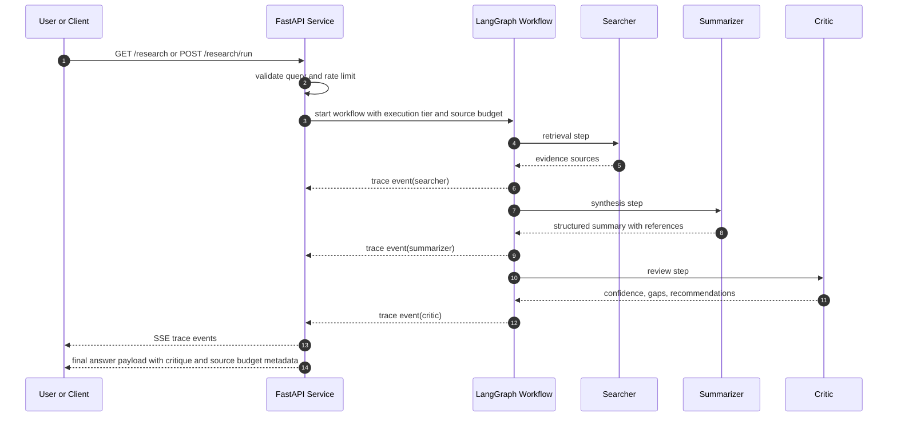

<!-- Generated by GitHub Copilot -->
# Sequence Diagram

```mermaid
sequenceDiagram
    autonumber
    participant U as User or Client
    participant API as FastAPI Service
    participant G as LangGraph Workflow
    participant S as Searcher
    participant Z as Summarizer
    participant C as Critic

    U->>API: GET /research or POST /research/run
    API->>API: validate query and rate limit
    API->>G: start workflow with execution tier and source budget

    G->>S: retrieval step
    S-->>G: evidence sources
    G-->>API: trace event(searcher)

    G->>Z: synthesis step
    Z-->>G: structured summary with references
    G-->>API: trace event(summarizer)

    G->>C: review step
    C-->>G: confidence, gaps, recommendations
    G-->>API: trace event(critic)

    API-->>U: SSE trace events
    API-->>U: final answer payload with critique and source budget metadata
```
