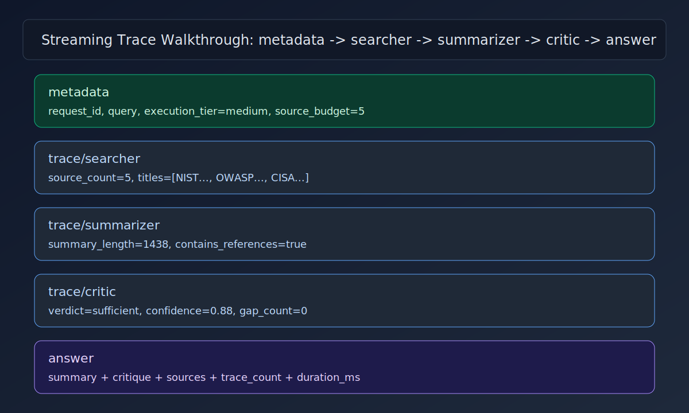

<!-- Generated by GitHub Copilot -->
# Trace Walkthrough

This walkthrough explains each stage emitted by the streaming research endpoint.

## Event Order

1. metadata
   - Includes request_id, query, execution_tier, and source_budget.
2. trace (searcher)
   - Shows retrieval stage with source_count and selected titles.
3. trace (summarizer)
   - Shows synthesis stage with summary length and references indicator.
4. trace (critic)
   - Shows review stage with verdict, confidence, and gap_count.
5. answer
   - Includes final summary, critique payload, sources, and duration_ms.

## How to Read the Trace Quickly

1. Check metadata first to confirm budget mode and request id.
2. Review searcher payload to verify evidence breadth.
3. Confirm summarizer references are present.
4. Inspect critic confidence and gaps for decision readiness.
5. Use request_id for incident debugging and support handoffs.
